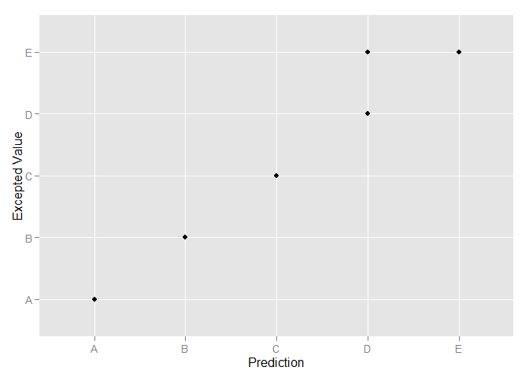

# Machine Learning Course Project
Sepand Haghighi  
Wednesday, March 14, 2015  
# Introduction          
according to dataset :     
Six young health participants were asked to perform one set of 10 repetitions of the Unilateral Dumbbell Biceps Curl in five different fashions: exactly according to the specification (Class A), throwing the elbows to the front (Class B), lifting the dumbbell only halfway (Class C), lowering the dumbbell only halfway (Class D) and throwing the hips to the front (Class E).           

Our goal in this project is predicting class type by other variable .         

#1 - Read Input And Slicing           


In this part first we read data from csv files and then create split data to training and testing data set.  60% -- > Training , 20% --> Testing , 20%-->Cross Validation               


```r
library(lattice)
library(ggplot2)
library(caret)
library(randomForest)
```

```
## randomForest 4.6-10
## Type rfNews() to see new features/changes/bug fixes.
```

```r
raw_data<-read.csv("pml-training.csv")
test_data<-read.csv("pml-testing.csv")
index<-createDataPartition(raw_data$classe,p=0.6,list=FALSE)
training<-raw_data[index,]
temp<-raw_data[-index,]
index2<-createDataPartition(temp$classe,p=0.5,list=FALSE)

testing<-temp[-index2,]
cross<-temp[index2,]
```
#2 - Summary Of Dataset  

Summary Of  Training Dataset And Number Of Features :        


```r
summary(str(training))
```

```
## 'data.frame':	11776 obs. of  160 variables:
##  $ X                       : int  3 6 7 9 10 11 12 13 14 15 ...
##  $ user_name               : Factor w/ 6 levels "adelmo","carlitos",..: 2 2 2 2 2 2 2 2 2 2 ...
##  $ raw_timestamp_part_1    : int  1323084231 1323084232 1323084232 1323084232 1323084232 1323084232 1323084232 1323084232 1323084232 1323084232 ...
##  $ raw_timestamp_part_2    : int  820366 304277 368296 484323 484434 500302 528316 560359 576390 604281 ...
##  $ cvtd_timestamp          : Factor w/ 20 levels "02/12/2011 13:32",..: 9 9 9 9 9 9 9 9 9 9 ...
##  $ new_window              : Factor w/ 2 levels "no","yes": 1 1 1 1 1 1 1 1 1 1 ...
##  $ num_window              : int  11 12 12 12 12 12 12 12 12 12 ...
##  $ roll_belt               : num  1.42 1.45 1.42 1.43 1.45 1.45 1.43 1.42 1.42 1.45 ...
##  $ pitch_belt              : num  8.07 8.06 8.09 8.16 8.17 8.18 8.18 8.2 8.21 8.2 ...
##  $ yaw_belt                : num  -94.4 -94.4 -94.4 -94.4 -94.4 -94.4 -94.4 -94.4 -94.4 -94.4 ...
##  $ total_accel_belt        : int  3 3 3 3 3 3 3 3 3 3 ...
##  $ kurtosis_roll_belt      : Factor w/ 397 levels "","-0.016850",..: 1 1 1 1 1 1 1 1 1 1 ...
##  $ kurtosis_picth_belt     : Factor w/ 317 levels "","-0.021887",..: 1 1 1 1 1 1 1 1 1 1 ...
##  $ kurtosis_yaw_belt       : Factor w/ 2 levels "","#DIV/0!": 1 1 1 1 1 1 1 1 1 1 ...
##  $ skewness_roll_belt      : Factor w/ 395 levels "","-0.003095",..: 1 1 1 1 1 1 1 1 1 1 ...
##  $ skewness_roll_belt.1    : Factor w/ 338 levels "","-0.005928",..: 1 1 1 1 1 1 1 1 1 1 ...
##  $ skewness_yaw_belt       : Factor w/ 2 levels "","#DIV/0!": 1 1 1 1 1 1 1 1 1 1 ...
##  $ max_roll_belt           : num  NA NA NA NA NA NA NA NA NA NA ...
##  $ max_picth_belt          : int  NA NA NA NA NA NA NA NA NA NA ...
##  $ max_yaw_belt            : Factor w/ 68 levels "","-0.1","-0.2",..: 1 1 1 1 1 1 1 1 1 1 ...
##  $ min_roll_belt           : num  NA NA NA NA NA NA NA NA NA NA ...
##  $ min_pitch_belt          : int  NA NA NA NA NA NA NA NA NA NA ...
##  $ min_yaw_belt            : Factor w/ 68 levels "","-0.1","-0.2",..: 1 1 1 1 1 1 1 1 1 1 ...
##  $ amplitude_roll_belt     : num  NA NA NA NA NA NA NA NA NA NA ...
##  $ amplitude_pitch_belt    : int  NA NA NA NA NA NA NA NA NA NA ...
##  $ amplitude_yaw_belt      : Factor w/ 4 levels "","#DIV/0!","0.00",..: 1 1 1 1 1 1 1 1 1 1 ...
##  $ var_total_accel_belt    : num  NA NA NA NA NA NA NA NA NA NA ...
##  $ avg_roll_belt           : num  NA NA NA NA NA NA NA NA NA NA ...
##  $ stddev_roll_belt        : num  NA NA NA NA NA NA NA NA NA NA ...
##  $ var_roll_belt           : num  NA NA NA NA NA NA NA NA NA NA ...
##  $ avg_pitch_belt          : num  NA NA NA NA NA NA NA NA NA NA ...
##  $ stddev_pitch_belt       : num  NA NA NA NA NA NA NA NA NA NA ...
##  $ var_pitch_belt          : num  NA NA NA NA NA NA NA NA NA NA ...
##  $ avg_yaw_belt            : num  NA NA NA NA NA NA NA NA NA NA ...
##  $ stddev_yaw_belt         : num  NA NA NA NA NA NA NA NA NA NA ...
##  $ var_yaw_belt            : num  NA NA NA NA NA NA NA NA NA NA ...
##  $ gyros_belt_x            : num  0 0.02 0.02 0.02 0.03 0.03 0.02 0.02 0.02 0 ...
##  $ gyros_belt_y            : num  0 0 0 0 0 0 0 0 0 0 ...
##  $ gyros_belt_z            : num  -0.02 -0.02 -0.02 -0.02 0 -0.02 -0.02 0 -0.02 0 ...
##  $ accel_belt_x            : int  -20 -21 -22 -20 -21 -21 -22 -22 -22 -21 ...
##  $ accel_belt_y            : int  5 4 3 2 4 2 2 4 4 2 ...
##  $ accel_belt_z            : int  23 21 21 24 22 23 23 21 21 22 ...
##  $ magnet_belt_x           : int  -2 0 -4 1 -3 -5 -2 -3 -8 -1 ...
##  $ magnet_belt_y           : int  600 603 599 602 609 596 602 606 598 597 ...
##  $ magnet_belt_z           : int  -305 -312 -311 -312 -308 -317 -319 -309 -310 -310 ...
##  $ roll_arm                : num  -128 -128 -128 -128 -128 -128 -128 -128 -128 -129 ...
##  $ pitch_arm               : num  22.5 22 21.9 21.7 21.6 21.5 21.5 21.4 21.4 21.4 ...
##  $ yaw_arm                 : num  -161 -161 -161 -161 -161 -161 -161 -161 -161 -161 ...
##  $ total_accel_arm         : int  34 34 34 34 34 34 34 34 34 34 ...
##  $ var_accel_arm           : num  NA NA NA NA NA NA NA NA NA NA ...
##  $ avg_roll_arm            : num  NA NA NA NA NA NA NA NA NA NA ...
##  $ stddev_roll_arm         : num  NA NA NA NA NA NA NA NA NA NA ...
##  $ var_roll_arm            : num  NA NA NA NA NA NA NA NA NA NA ...
##  $ avg_pitch_arm           : num  NA NA NA NA NA NA NA NA NA NA ...
##  $ stddev_pitch_arm        : num  NA NA NA NA NA NA NA NA NA NA ...
##  $ var_pitch_arm           : num  NA NA NA NA NA NA NA NA NA NA ...
##  $ avg_yaw_arm             : num  NA NA NA NA NA NA NA NA NA NA ...
##  $ stddev_yaw_arm          : num  NA NA NA NA NA NA NA NA NA NA ...
##  $ var_yaw_arm             : num  NA NA NA NA NA NA NA NA NA NA ...
##  $ gyros_arm_x             : num  0.02 0.02 0 0.02 0.02 0.02 0.02 0.02 0.02 0.02 ...
##  $ gyros_arm_y             : num  -0.02 -0.03 -0.03 -0.03 -0.03 -0.03 -0.03 -0.02 0 0 ...
##  $ gyros_arm_z             : num  -0.02 0 0 -0.02 -0.02 0 0 -0.02 -0.03 -0.03 ...
##  $ accel_arm_x             : int  -289 -289 -289 -288 -288 -290 -288 -287 -288 -289 ...
##  $ accel_arm_y             : int  110 111 111 109 110 110 111 111 111 111 ...
##  $ accel_arm_z             : int  -126 -122 -125 -122 -124 -123 -123 -124 -124 -124 ...
##  $ magnet_arm_x            : int  -368 -369 -373 -369 -376 -366 -363 -372 -371 -374 ...
##  $ magnet_arm_y            : int  344 342 336 341 334 339 343 338 331 342 ...
##  $ magnet_arm_z            : int  513 513 509 518 516 509 520 509 523 510 ...
##  $ kurtosis_roll_arm       : Factor w/ 330 levels "","-0.02438",..: 1 1 1 1 1 1 1 1 1 1 ...
##  $ kurtosis_picth_arm      : Factor w/ 328 levels "","-0.00484",..: 1 1 1 1 1 1 1 1 1 1 ...
##  $ kurtosis_yaw_arm        : Factor w/ 395 levels "","-0.01548",..: 1 1 1 1 1 1 1 1 1 1 ...
##  $ skewness_roll_arm       : Factor w/ 331 levels "","-0.00051",..: 1 1 1 1 1 1 1 1 1 1 ...
##  $ skewness_pitch_arm      : Factor w/ 328 levels "","-0.00184",..: 1 1 1 1 1 1 1 1 1 1 ...
##  $ skewness_yaw_arm        : Factor w/ 395 levels "","-0.00311",..: 1 1 1 1 1 1 1 1 1 1 ...
##  $ max_roll_arm            : num  NA NA NA NA NA NA NA NA NA NA ...
##  $ max_picth_arm           : num  NA NA NA NA NA NA NA NA NA NA ...
##  $ max_yaw_arm             : int  NA NA NA NA NA NA NA NA NA NA ...
##  $ min_roll_arm            : num  NA NA NA NA NA NA NA NA NA NA ...
##  $ min_pitch_arm           : num  NA NA NA NA NA NA NA NA NA NA ...
##  $ min_yaw_arm             : int  NA NA NA NA NA NA NA NA NA NA ...
##  $ amplitude_roll_arm      : num  NA NA NA NA NA NA NA NA NA NA ...
##  $ amplitude_pitch_arm     : num  NA NA NA NA NA NA NA NA NA NA ...
##  $ amplitude_yaw_arm       : int  NA NA NA NA NA NA NA NA NA NA ...
##  $ roll_dumbbell           : num  12.9 13.4 13.1 13.2 13.3 ...
##  $ pitch_dumbbell          : num  -70.3 -70.8 -70.2 -70.4 -70.9 ...
##  $ yaw_dumbbell            : num  -85.1 -84.5 -85.1 -84.9 -84.4 ...
##  $ kurtosis_roll_dumbbell  : Factor w/ 398 levels "","-0.0035","-0.0073",..: 1 1 1 1 1 1 1 1 1 1 ...
##  $ kurtosis_picth_dumbbell : Factor w/ 401 levels "","-0.0163","-0.0233",..: 1 1 1 1 1 1 1 1 1 1 ...
##  $ kurtosis_yaw_dumbbell   : Factor w/ 2 levels "","#DIV/0!": 1 1 1 1 1 1 1 1 1 1 ...
##  $ skewness_roll_dumbbell  : Factor w/ 401 levels "","-0.0082","-0.0096",..: 1 1 1 1 1 1 1 1 1 1 ...
##  $ skewness_pitch_dumbbell : Factor w/ 402 levels "","-0.0053","-0.0084",..: 1 1 1 1 1 1 1 1 1 1 ...
##  $ skewness_yaw_dumbbell   : Factor w/ 2 levels "","#DIV/0!": 1 1 1 1 1 1 1 1 1 1 ...
##  $ max_roll_dumbbell       : num  NA NA NA NA NA NA NA NA NA NA ...
##  $ max_picth_dumbbell      : num  NA NA NA NA NA NA NA NA NA NA ...
##  $ max_yaw_dumbbell        : Factor w/ 73 levels "","-0.1","-0.2",..: 1 1 1 1 1 1 1 1 1 1 ...
##  $ min_roll_dumbbell       : num  NA NA NA NA NA NA NA NA NA NA ...
##  $ min_pitch_dumbbell      : num  NA NA NA NA NA NA NA NA NA NA ...
##  $ min_yaw_dumbbell        : Factor w/ 73 levels "","-0.1","-0.2",..: 1 1 1 1 1 1 1 1 1 1 ...
##  $ amplitude_roll_dumbbell : num  NA NA NA NA NA NA NA NA NA NA ...
##   [list output truncated]
```

```
## Length  Class   Mode 
##      0   NULL   NULL
```
          
          

#3 - Create Model
For choosing features , first deleted columns with NA values . For this kind of prediction problems most of the times randomforest model is the best.   
Using num_winodw as predictor because this feature is on a direct direction with each classe  , randomforest as learning method , center and scale as preprocess method and repeatedcv as traincontrol.    


```r
training$classe<-as.factor(training$classe)
model<-train(classe~num_window,data=training,method='rf',preProcess=c("center","scale"),trControl = trainControl(method="repeatedcv"))
```
#4 - Out And In Sample Error Approximation    

In this part without apply this algorithm on testing part , we estimating the out sample error with cross validation . 
and it is about 99%.

```r
cv_result<-predict(model,cross)
confusionMatrix(cv_result,cross[,"classe"])
```

```
## Confusion Matrix and Statistics
## 
##           Reference
## Prediction    A    B    C    D    E
##          A 1116    0    0    0    0
##          B    0  758    0    0    0
##          C    0    0  684    0    0
##          D    0    0    0  643    0
##          E    0    1    0    0  721
## 
## Overall Statistics
##                                     
##                Accuracy : 1         
##                  95% CI : (0.999, 1)
##     No Information Rate : 0.284     
##     P-Value [Acc > NIR] : <2e-16    
##                                     
##                   Kappa : 1         
##  Mcnemar's Test P-Value : NA        
## 
## Statistics by Class:
## 
##                      Class: A Class: B Class: C Class: D Class: E
## Sensitivity             1.000    0.999    1.000    1.000    1.000
## Specificity             1.000    1.000    1.000    1.000    1.000
## Pos Pred Value          1.000    1.000    1.000    1.000    0.999
## Neg Pred Value          1.000    1.000    1.000    1.000    1.000
## Prevalence              0.284    0.193    0.174    0.164    0.184
## Detection Rate          0.284    0.193    0.174    0.164    0.184
## Detection Prevalence    0.284    0.193    0.174    0.164    0.184
## Balanced Accuracy       1.000    0.999    1.000    1.000    1.000
```
#5 - Out Sample Error    


```r
result<-predict(model,testing)

confusionMatrix(result,testing[,"classe"])
```

```
## Confusion Matrix and Statistics
## 
##           Reference
## Prediction    A    B    C    D    E
##          A 1116    0    0    0    0
##          B    0  759    0    0    0
##          C    0    0  684    0    0
##          D    0    0    0  643    1
##          E    0    0    0    0  720
## 
## Overall Statistics
##                                     
##                Accuracy : 1         
##                  95% CI : (0.999, 1)
##     No Information Rate : 0.284     
##     P-Value [Acc > NIR] : <2e-16    
##                                     
##                   Kappa : 1         
##  Mcnemar's Test P-Value : NA        
## 
## Statistics by Class:
## 
##                      Class: A Class: B Class: C Class: D Class: E
## Sensitivity             1.000    1.000    1.000    1.000    0.999
## Specificity             1.000    1.000    1.000    1.000    1.000
## Pos Pred Value          1.000    1.000    1.000    0.998    1.000
## Neg Pred Value          1.000    1.000    1.000    1.000    1.000
## Prevalence              0.284    0.193    0.174    0.164    0.184
## Detection Rate          0.284    0.193    0.174    0.164    0.184
## Detection Prevalence    0.284    0.193    0.174    0.164    0.184
## Balanced Accuracy       1.000    1.000    1.000    1.000    0.999
```
#6 - Plotting      
Plot Each Class Position         


```r
qplot(result,testing$classe,xlab="Prediction",ylab="Excepted Value")
```

 

              
* We can see some misclassification in  "E" Class. 

#7 - 20 Test Result    

```r
test_result<-predict(model,test_data)
print(test_result)
```

```
##  [1] B A B A A E D B A A B C B A E E A B B B
## Levels: A B C D E
```

#8 - Reference 
Velloso, E.; Bulling, A.; Gellersen, H.; Ugulino, W.; Fuks, H. Qualitative Activity Recognition of Weight Lifting Exercises. Proceedings of 4th International Conference in Cooperation with SIGCHI (Augmented Human '13) . Stuttgart, Germany: ACM SIGCHI, 2013.


